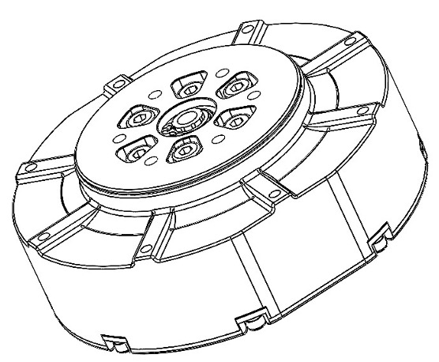

# GO-M8010-6 Motor 使用手册





## 产品使用注意事项
```warning
电机扭矩较大，若使用不当可能会对人身财产造成严重伤害和破坏，因此在使用时，务必注意安全。
GO-8010-6 电机力矩较大，为了避免潜在的安全风险，务必谨慎操作。非专业用户及未满18岁用户请勿使用。
```
1. GO-8010-6电机最大允许电压为DC-30V，务必遵守相关安全规范进行操作。
2. 使用时请注意控制电机参数，不要让输出力矩过大或电机末端安装大惯量负载。
3. 使用前请检查好电机是否正常，是否堵转等。如有异常，请及时更换。
4. 使用时要注意电机的温度，双手不要去触摸电机表面以免烫伤。
5. 安装、卸载输出端机械结构时务必断开电机电源。

## 免责声明
```note
感谢您购买GO-M8010-6电机。在使用前，请仔细阅读本声明，一旦使用，即被视为对本声明全部内容的认可和接受。请严格遵循手册使用该产品。因用户不当使用、安装、改装造成的任何损失，杭州宇树科技有限公司将不承担任何责任。

Unitree 是杭州宇树科技有限公司的商标。本文出现的产品名称、品牌等，均为其所属公司的商标或注册商标。本产品及手册为杭州宇树科技有限公司版权所有。未经许可，不得以任何形式复制翻印。

关于不同语言版本的免责声明可能存在的语义差异，中国以中文版为准，其他地区以英文版为准。
```
