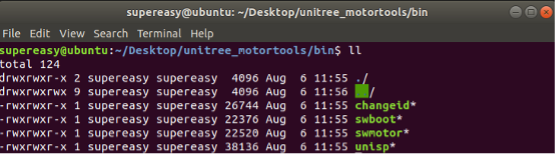
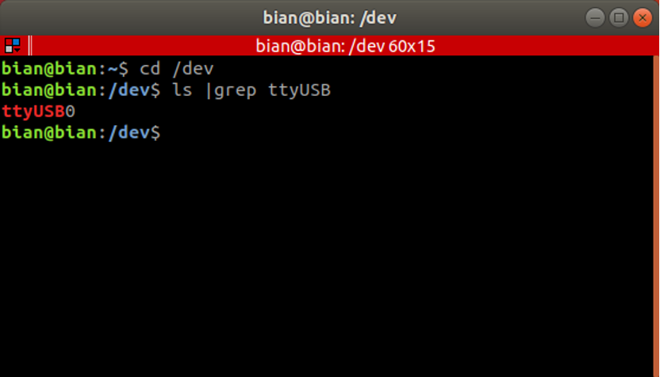
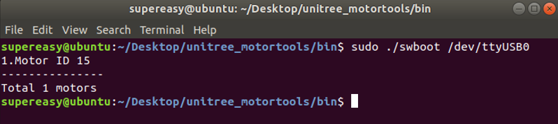
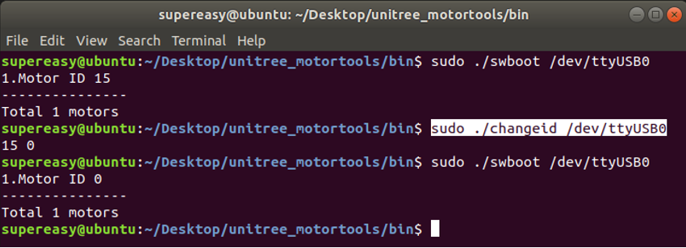
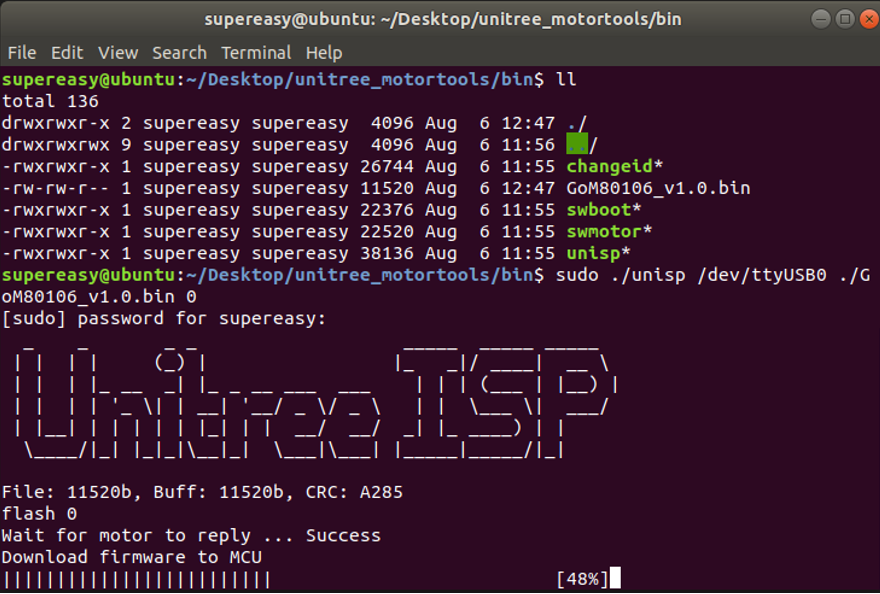

## 相关配置
&emsp;&emsp;宇树提供了电机工具箱`Unitree MotorTools`让用户可以更方便地进行配置工作，如更改ID、电机固件升级等。解压 Unitree MotorTools工具箱，进入bin文件夹后可以看到一些可执行程序，这里提供了常见的一些对电机修改的工具。
<center>

<br>
<div style="color:orange; border-bottom: 0.1px solid #d9d9d9;
display: inline-block;
color: #999;
padding: 1px;">Unitree MotorTools工具箱</div>
</center>
<br>


### 查看串口名
&emsp;&emsp;将USB转RS-485转接口连接在上位机上时，上位机会为这个串口分配一个串口名。在Linux系统中，这个串口名一般是以“ttyUSB”开头，在Windows系统中，串口名往往以“COM”开头。<br>
&emsp;&emsp;在Linux系统中，一切外接设备都是以文件形式存在的。USB转RS-485转接器也可以被视为/dev文件夹下的一个“文件”。打开任意一个终端窗口（在Ubuntu下快捷键为Ctrl+Alt+t组合键），运行如下命令：
```
cd /dev
ls | grep ttyUSB
```
&emsp;&emsp;其中cd /dev命令将当前文件夹切换为/dev， ls |grep ttyUSB命令显示当前文件夹下所有文件名包含ttyUSB的文件，其中的 | 符号就在键盘的回车键上方，按住Shift+\即可键入”|”字符。运行如上命令后，即可得到上位机当前连接的串口名。例如图3所示，当前上位机连接的串口名为ttyUSB0。考虑到串口所在的文件夹路径，其完整的串口名为/dev/ttyUSB0。
<center>

<br>
<div style="color:orange; border-bottom: 0.1px solid #d9d9d9;
display: inline-block;
color: #999;
padding: 1px;">Ubuntu系统查看串口名</div>
</center>
<br>
```note
串口名的序号和插入设备的顺序一致，对于连接多个设备这很有帮助。
```

### 查看电机ID
&emsp;&emsp;查看和修改电机ID需要将电机切换到工厂模式，切换前请确保所有电机已经停止工作，主机也不再向电机发送运动控制指令。
```
sudo ./swboot /dev/ttyUSB
```
稍等片刻，进入工厂模式的电机背部绿色指示灯会变成每秒快速闪烁3次的状态，此时终端上会显示所有已经进入工厂模式的电机。
<center>

<br>
<div style="color:orange; border-bottom: 0.1px solid #d9d9d9;
display: inline-block;
color: #999;
padding: 1px;">查看电机ID</div>
</center>
<br>
&emsp;&emsp;正常情况，打印的列表中不会有ID大于15的电机。如果这发生了请重新给电机上电再试一次。
如果存在ID为15的电机，则说明该电机还没有设置ID，您可以参照6.4配置。

### 更改电机ID
要修改电机的ID需要使用 changeid 命令，用法为：

changeid [串口号] [原来的ID] [要修改的ID]<br>
例：changeid /dev/ttyUSB0 0 1  :设置电机ID0为ID1

切换前请确保所有电机已经停止工作，主机也不再向电机发送运动控制指令。

例如：将总线上所有ID为15的电机修改为ID 0

```
sudo ./changed /dev/ttyUSB0 15 0
```
<center>

<br>
<div style="color:orange; border-bottom: 0.1px solid #d9d9d9;
display: inline-block;
color: #999;
padding: 1px;">更改电机ID</div>
</center>
<br>

### 电机固件升级
&emsp;&emsp;Go-M8010-6电机支持升级电机固件，方便后期提高电机性能和安全修复，您可以将宇树科技提供给您的固件文件使用 unisp 工具下载到电机中。要升级电机固件需要使用 unisp命令，用法为：<br>
unisp [串口号] [.bin升级文件] [要刷入的电机ID] <br>
例：unisp /dev/ttyUSB0 ./GoM80106_v1.0.bin 0
<center>

<br>
<div style="color:orange; border-bottom: 0.1px solid #d9d9d9;
display: inline-block;
color: #999;
padding: 1px;">升级电机ISP</div>
</center>
<br>
```note
请不要给电机下载来历不明的电机固件，这是非常危险的行为。
风险不仅限于电机变砖、意外伤人、烧毁电机、丧失质保等等
```

### 切换回电机模式
&emsp;&emsp;查看和修改电机ID会让电机切换到工厂模式，如果不手动切换回电机模式，即使给电机重新上电也还会进入工厂模式。<br>
&emsp;&emsp;进入工厂模式的电机背部绿色指示灯会变成每秒快速闪烁3次的状态。
此时使用命令 ./swmotor 即可切换到电机模式，用法为：<br>
swmotor [串口号]<br>
例：sudo ./swmotor /dev/ttyUSB0<br>
即可让该RS485总线上所有的电机切换到电机模式，此时电机就可以接收运动控制指令了。

```note
没有固件的电机不会被启动，并且会在终端上显示。
```