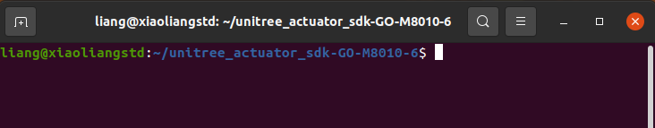
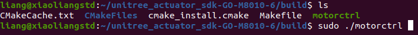

## C++ 范例试运行
### 例程
&emsp;&emsp;下面我们尝试让电机转起来。
首先打开src文件夹下的main.cpp文件，第一步要做的就是修改串口名。如果只在一个系统下运行，那么只修改这一系统下的串口名即可：
```
SerialPort _ioPort("/dev/ttyUSB0");
```
接下来是声明发送给电机的命令和从电机接收回来的状态：
```
MotorCmd cmd;
MotorData data; 
```
&emsp;&emsp;其中cmd是给电机发送的控制命令包，它们都是MotorCmd类型的结构体。所谓结构体，即包含了许多不同类型数据的数据包，我们马上就会展示针对结构体的操作。同理data是接收电机状态信息的数据包，它是一个MotorData类型的结构体。关于这两个结构体的具体内容，可以参考include/unitreeMotor/unitreeMotor.h文件，在此不再赘述。
&emsp;&emsp;接下来我们修改cmd。首先解释一下MotorCmd类型结构体包含的数据：
1. `Id`：当前控制命令的目标电机ID
2. `mode`: 目标电机运行模式。 0.停止 1.FOC 2.电机标定
3. `T`: 前馈力矩$$\tau_{ff}$$
4. `W`: 指定角速度$$\omega_{des}$$
5. `Pos`: 指定角度位置$$K_{des}$$
6. `K_P`: 位置刚度$$K_p$$
7. `K_W`: 速度刚度（阻尼)$$K_d$$<br>
&emsp;&emsp;当mode的值为0时，后面的5个控制参数并没有任何作用。当mode的值为2时，表示进行电机标定。在这个例子中我们将mode的值设为1。这里我们让电机以恒定的速度旋转，完整的代码为：
```
cmd.motorType = MotorType::Go2;
cmd.id = 0;
cmd.mode = 1;
cmd.K_P = 0;
cmd.W = 6.28*6.33;
cmd.K_W = 0.001;
cmd.T = 0.0;
_ioPort.sendRecv(&cmd,&data);
```
下面我们就可以给电机发送命令了，控制命令会通过_ioPort对象的sendRecv(&cmd,&data)函数给电机发送一次控制命令，并接收一次电机的当前状态信息。

```note
此处需要特别注意的是，给电机发送的命令都是针对减速器之前的电机转子，即下图中的转轴1。而不是经过减速之后的输出轴2。所以在进行实际控制的过程中，一定要注意考虑电机的减速比。在GO-8010-6的电机中，减速比为`6.33`。
```

<center>

<br>
<div style="color:orange; border-bottom: 0.1px solid #d9d9d9;
display: inline-block;
color: #999;
padding: 1px;">电机输出端</div>
</center>
<br>

### 编译运行
&emsp;&emsp;在了解例程后，下面让我们编译运行该例程。首先在终端将目录切换至unitree_actuator_sdk文件夹的根目录，如下图所示
<center>

<br>
<div style="color:orange; border-bottom: 0.1px solid #d9d9d9;
display: inline-block;
color: #999;
padding: 1px;">目录切换</div>
</center>
<br>
然后依次输入下列四条指令，即每输入一次按一次回车键，让该条指令生效后再输入下一条。这四条指令的目的是编译上述例程源文件并将生成的可执行文件放置于build文件夹。

```
mkdir build
cd build 
cmake ..
make
```
执行完所有步骤后，如果一切正常，使用`ls`命令即可查看到该目录下出现了显示为绿色的可执行文件，如下图所示
<center>

<br>
<div style="color:orange; border-bottom: 0.1px solid #d9d9d9;
display: inline-block;
color: #999;
padding: 1px;">生成的可执行文件与运行</div>
</center>
<br>

以上图为例，在终端输入`sudo ./motorctrl`即可运行该例程。